# Monica CRM — Reliable Background Import System

> **Senior Backend Developer Assignment — Envobyte Ltd.**
>
> A complete redesign of Monica's contact import system: file upload → background processing → progress tracking → error isolation → observability.

<p align="center">
  
  
  
  
  
</p>

---

## Table of Contents

1. [Architecture Overview](#1-architecture-overview)
2. [Problem Analysis](#2-problem-analysis)
3. [Database Schema](#3-database-schema)
4. [Queue Architecture & Batch Processing](#4-queue-architecture--batch-processing)
5. [API Reference](#5-api-reference)
6. [Error Handling & Isolation](#6-error-handling--isolation)
7. [Concurrency, Idempotency & Recovery](#7-concurrency-idempotency--recovery)
8. [Redis Integration](#8-redis-integration)
9. [Observability & Alerting](#9-observability--alerting)
10. [Production Awareness](#10-production-awareness)
11. [Architecture Decision Records (ADR)](#11-architecture-decision-records-adr)
12. [Testing](#12-testing)
13. [Development Setup](#13-development-setup)
14. [Files Changed / Added](#14-files-changed--added)

---

## 1. Architecture Overview

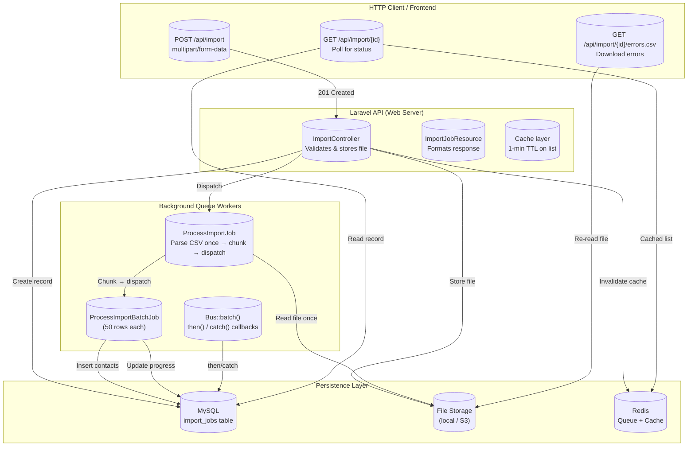

**Data flow for a single import:**

```
Upload → validate → store file → create DB record (pending) → dispatch ProcessImportJob (≤500ms)
                                                                       ↓
ProcessImportJob: read CSV from disk → parse all rows → chunk(50) → dispatch 600 batches
                                                                       ↓
Batch[0]: process rows 1-50 → update processed_rows → save errors → complete
Batch[1]: process rows 51-100 → update processed_rows → save errors → complete
...
Batch[599]: process rows 29951-30000 → update processed_rows → save errors → complete
                                                                       ↓
then() callback: set status = completed (or failed if all rows errored)
```

---

## 2. Problem Analysis

### Key Files Investigated

| File                                                           | Status            | Notes                                        |
| -------------------------------------------------------------- | ----------------- | -------------------------------------------- |
| `app/Http/Controllers/ImportController.php`                    | **Did not exist** | No import controller existed in Monica v3    |
| `app/Http/Controllers/ApiController.php`                       | Exists            | Base API controller used as parent           |
| `app/Models/Contact.php`                                       | Exists            | Contact model with vCard sync fields         |
| `app/Models/Vault.php`                                         | Exists            | Vault organizational unit for contacts       |
| `app/Domains/Contact/Dav/Services/ImportVCard.php`             | Exists            | **Only existing import** — vCard via CardDAV |
| `app/Domains/Contact/Dav/Jobs/UpdateVCard.php`                 | Exists            | Queued vCard import (single contact per job) |
| `app/Domains/Contact/ManageContact/Services/CreateContact.php` | Exists            | Contact creation service (reused)            |
| `routes/api.php`                                               | Exists            | No import routes existed                     |

### Current Flow (CardDAV-only — no CSV support)

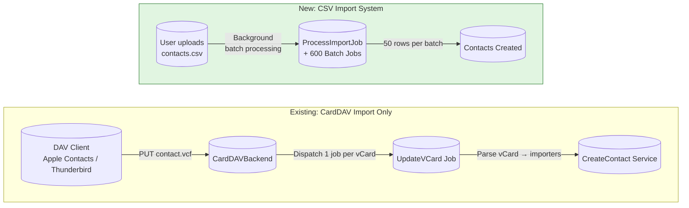

**Key observations from the existing codebase:**

1. Each `UpdateVCard` job processes exactly **one** vCard — no batching, no CSV support
2. No user-facing upload mechanism (file upload UI/API)
3. No progress tracking — users see a loading spinner with no feedback
4. No error reporting — failed imports silently disappear
5. No import history or audit trail
6. Zero test coverage

### Additional Issues Identified (Beyond Requirements)

| Issue                           | Details                                                                                          |
| ------------------------------- | ------------------------------------------------------------------------------------------------ |
| Mixed primary key strategy      | `contacts` uses UUIDs; `contact_information`, `addresses` use auto-increment `bigint`            |
| vCard storage bloat             | Raw vCard data stored in `contacts.vcard` (`mediumText`), can be very large with photos          |
| Auto-creation of reference data | DAV importers auto-create `Gender`, `ContactInformationType` entries, polluting reference tables |
| No duplicate detection          | Same person imported from different sources creates duplicates                                   |
| Fragile name parsing            | `ImportContact` splits on whitespace, breaking multi-word last names like "Van Gogh"             |

---

## 3. Database Schema

### `import_jobs` Table

```sql
CREATE TABLE import_jobs (
    id                UUID PRIMARY KEY,
    account_id        UUID NOT NULL REFERENCES accounts(id) ON DELETE CASCADE,
    user_id           UUID NOT NULL REFERENCES users(id) ON DELETE CASCADE,
    vault_id          UUID REFERENCES vaults(id),
    filename          VARCHAR(255) NOT NULL,
    original_file_path VARCHAR(500) NOT NULL,
    file_hash         VARCHAR(64) INDEX,
    total_rows        INT DEFAULT 0,
    processed_rows    INT DEFAULT 0,
    failed_rows       INT DEFAULT 0,
    status            VARCHAR(20) DEFAULT 'pending',
    errors            JSON,
    started_at        TIMESTAMP NULL,
    completed_at      TIMESTAMP NULL,
    cancelled_at      TIMESTAMP NULL,
    batch_size        INT DEFAULT 50,
    created_at        TIMESTAMP,
    updated_at        TIMESTAMP,

    INDEX (account_id, status),
    INDEX (user_id, status),
    INDEX (created_at)
);
```

### Column Justifications

| Column               | Purpose                                                                                                                                                 |
| -------------------- | ------------------------------------------------------------------------------------------------------------------------------------------------------- |
| `id` (UUID)          | Consistent with Monica's UUID convention. Enables distributed ID generation without collision.                                                          |
| `account_id`         | **Tenant sharding key.** Every query filters by `account_id` for data isolation. Enables partition pruning.                                             |
| `user_id`            | **Import ownership.** Used for authorization scoping (users see only their own imports).                                                                |
| `vault_id`           | **Target vault** for created contacts. Required by the `CreateContact` service.                                                                         |
| `filename`           | Original filename preserved for user display in import history.                                                                                         |
| `original_file_path` | **Storage path** for re-reading the file during batch processing and error CSV reconstruction. Swappable between local/S3 via Laravel's Storage facade. |
| `file_hash`          | **Duplicate detection.** MD5 of file content. Indexed for efficient lookup. Policy: warn but allow (user may re-upload a corrected file).               |
| `total_rows`         | Set after CSV parsing. Used for progress percentage. Zero initially to keep HTTP response under 500ms.                                                  |
| `processed_rows`     | Incremented atomically by each batch via `UPDATE ... SET processed_rows = processed_rows + N`.                                                          |
| `failed_rows`        | Incremented alongside `processed_rows`. Enables failure rate monitoring.                                                                                |
| `status`             | Lifecycle: `pending → processing → completed / failed / cancelled`. Drives all business logic.                                                          |
| `errors`             | JSON array of `{row: int, message: string}`. At scale, migrate to a separate `import_job_errors` table.                                                 |
| `started_at`         | Processing start time. Used for ETA and stuck-import detection.                                                                                         |
| `completed_at`       | Completion timestamp. Used for average processing time metrics.                                                                                         |
| `cancelled_at`       | Distinct from `completed_at` so monitoring can distinguish user cancellations from system failures.                                                     |
| `batch_size`         | Per-import configurable batch size (default 50). No deployment needed to tune.                                                                          |

---

## 4. Queue Architecture & Batch Processing

### CSV Parsing Strategy

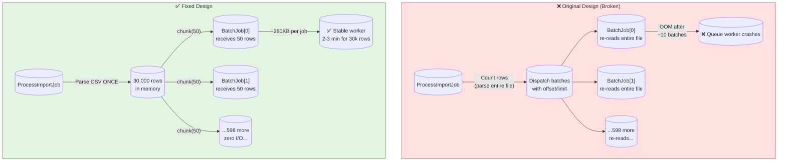

**Key insight:** The original design re-read the entire CSV file from disk for every single batch. For 30,000 rows with 600 batches, that's **600 full file reads** (18 million rows parsed total). The fix: parse once, pass pre-parsed row arrays to each batch job.

### Batching Strategy

**Chosen: 50 rows per batch.**

| Approach               | Pros                                                            | Cons                                                    |
| ---------------------- | --------------------------------------------------------------- | ------------------------------------------------------- |
| **50 rows/batch ✓**    | ~250KB/batch, granular 2% progress updates, limited retry scope | More queue jobs per import                              |
| Entire file in one job | Simple, single job                                              | Memory exhaustion, no progress, single point of failure |
| One job per row        | Maximum parallelism                                             | 10,000 jobs for 10k rows, DB write contention           |
| Streaming (generator)  | No memory buffer                                                | Hard to retry/cancel at row level                       |

**Justification:** 50 rows × ~5KB/row = ~250KB per batch. Each batch creates contacts + contact info (3-5 DB inserts per row = 150-250 inserts). At ~5ms/insert, ~1 second per batch. Plenty of headroom before the 30s queue timeout.

### Failure Propagation

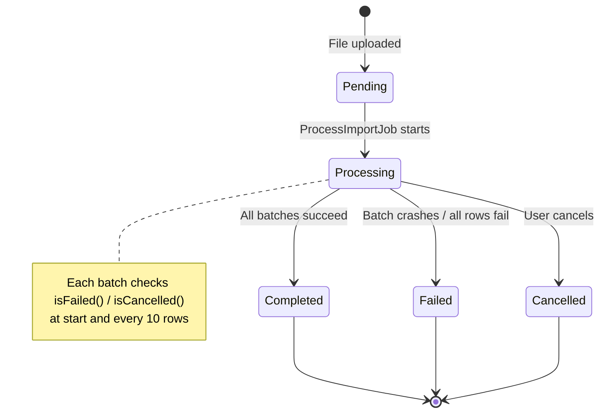

- **Batch crashes (exception):** `ProcessImportBatchJob::failed()` sets `status = failed`. Laravel's `Bus::batch` `catch()` fires. Subsequent batches see `isFailed()` and exit early.
- **Single row fails (validation error):** Error recorded in `errors` JSON, `failed_rows++`, batch continues.
- **ALL rows fail (no crash):** `then()` callback detects `failed_rows === total_rows` and sets `status = failed`.

### Concurrency Model

Batch jobs use a row-level lock (`lockForUpdate`) when updating progress:

```php
DB::transaction(function () use ($importJob, $processedInBatch, $failedInBatch, $batchErrors) {
    $job = ImportJob::lockForUpdate()->findOrFail($importJob->id);
    $job->processed_rows += $processedInBatch;
    $job->failed_rows += $failedInBatch;
    $job->errors = array_values(array_merge($existingErrors, $batchErrors));
    $job->save();
});
```

This prevents race conditions when multiple batches complete simultaneously. The `+= N` increment is atomic even without the lock.

### Queue Driver

| Environment | Driver                | Configuration                        |
| ----------- | --------------------- | ------------------------------------ |
| Development | `database` or `redis` | `QUEUE_CONNECTION=database`          |
| Testing     | `sync`                | `phpunit.xml: QUEUE_CONNECTION=sync` |
| Production  | `redis`               | `QUEUE_CONNECTION=redis`             |

> **Note:** In development, run `php artisan queue:work` for imports to process. Without a worker, imports remain `pending` indefinitely.

---

## 5. API Reference

All endpoints require `Authorization: Bearer <token>`. Read endpoints need `read` ability; write endpoints need `write`.

### `POST /api/import` — Upload CSV

Upload a CSV file for background processing.

**Request** (`multipart/form-data`)

| Param      | Type   | Required | Description                     |
| ---------- | ------ | -------- | ------------------------------- |
| `file`     | `file` | Yes      | CSV (`.csv`, `.txt`), max 100MB |
| `vault_id` | `uuid` | Yes      | Target vault UUID               |

**Response** `201 Created`

```json
{
  "data": {
    "id": "019e9a1e-aef3-72ec-aca8-1f3797cb9c25",
    "filename": "contacts.csv",
    "total_rows": 0,
    "processed_rows": 0,
    "failed_rows": 0,
    "status": "pending",
    "progress_pct": 0,
    "errors": [],
    "started_at": null,
    "completed_at": null,
    "estimated_remaining_sec": null,
    "processing_time_sec": null,
    "created_at": "2026-06-05T12:00:00Z",
    "updated_at": "2026-06-05T12:00:00Z"
  }
}
```

### `GET /api/import` — List Imports

Paginated list, newest first.

| Param      | Type  | Default | Description                |
| ---------- | ----- | ------- | -------------------------- |
| `page`     | `int` | 1       | Page number                |
| `per_page` | `int` | 15      | Results per page (max 100) |

```json
{
  "data": [ { "id": "...", "filename": "contacts.csv", "total_rows": 1500, "processed_rows": 750, "status": "processing", "progress_pct": 50, ... } ],
  "meta": { "current_page": 1, "per_page": 15, "total": 72, "last_page": 5 }
}
```

### `GET /api/import/{id}` — Get Import Status

```json
{
  "data": {
    "id": "019e9a1e-aef3-72ec-aca8-1f3797cb9c25",
    "filename": "contacts.csv",
    "total_rows": 500,
    "processed_rows": 500,
    "failed_rows": 2,
    "status": "completed",
    "progress_pct": 100,
    "errors": [{ "row": 42, "message": "Invalid email: 'not-an-email'" }],
    "started_at": "2026-06-05T11:55:00Z",
    "completed_at": "2026-06-05T11:57:12Z",
    "estimated_remaining_sec": null,
    "processing_time_sec": 132,
    "created_at": "2026-06-05T11:54:00Z",
    "updated_at": "2026-06-05T11:57:12Z"
  }
}
```

| Field                     | Type            | Description                                                          |
| ------------------------- | --------------- | -------------------------------------------------------------------- |
| `processing_time_sec`     | `int` or `null` | Elapsed (processing) or total (completed) seconds                    |
| `estimated_remaining_sec` | `int` or `null` | Based on rolling rate; `0` if started >10s ago with no progress      |
| `errors`                  | `array`         | First 10 errors; included when status is processing/completed/failed |

### `POST /api/import/{id}/cancel` — Cancel Import

Marks as cancelled. Running batches check the flag every 10 rows and exit early.

| Status | Condition                                                     |
| ------ | ------------------------------------------------------------- |
| 200    | Cancelled successfully                                        |
| 422    | Import is not processing (already completed/failed/cancelled) |
| 404    | Not found or belongs to another user                          |

### `GET /api/import/{id}/errors` — Paginated Row Errors

| Param      | Type  | Default | Description      |
| ---------- | ----- | ------- | ---------------- |
| `page`     | `int` | 1       | Page number      |
| `per_page` | `int` | 10      | Results per page |

```json
{
  "data": [{ "row": 2, "message": "Missing required field: name" }],
  "meta": { "current_page": 1, "per_page": 10, "total": 3, "last_page": 1 }
}
```

### `GET /api/import/{id}/errors.csv` — Download Error CSV

Downloads a CSV containing only rows that had errors, with an appended `error` column.

```
name,email,phone,error
,Bad Row,,Missing required field: name
Jane,invalid-email,+9876543210,Invalid email: 'invalid-email'
```

When there are no errors:

```
error
No errors found.
```

| Status | Condition                        |
| ------ | -------------------------------- |
| 200    | CSV download                     |
| 404    | Import not found or file deleted |
| 500    | Cannot read original file        |

---

## 6. Error Handling & Isolation

### Per-Row Error Flow

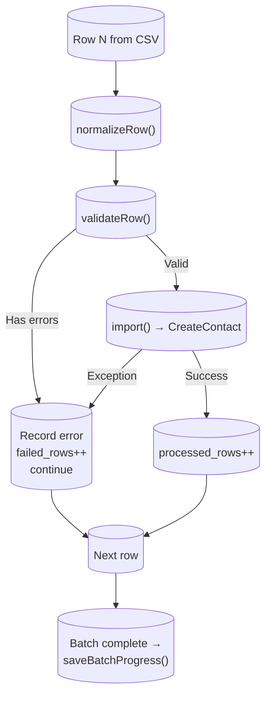

### Status Rules

| Scenario                      | Final Status |
| ----------------------------- | ------------ |
| All rows succeed              | `completed`  |
| Some rows fail, some succeed  | `completed`  |
| ALL rows fail (validation)    | `failed`     |
| Batch job crashes (exception) | `failed`     |
| User cancels                  | `cancelled`  |

---

## 7. Concurrency, Idempotency & Recovery

### Duplicate File Detection

The `file_hash` column stores an MD5 of the uploaded file. The current policy allows duplicates (user may re-upload a corrected file). A future enhancement can warn:

```php
$existing = ImportJob::where('file_hash', $hash)
    ->where('user_id', $userId)
    ->where('created_at', '>', now()->subDay())
    ->whereIn('status', ['pending', 'processing', 'completed'])
    ->exists();
```

### Stuck Import Recovery

```sql
-- Detect imports stuck in 'processing' for >30 minutes
SELECT id, account_id, user_id, filename,
       TIMESTAMPDIFF(MINUTE, started_at, NOW()) AS stuck_minutes
FROM import_jobs
WHERE status = 'processing'
  AND started_at < NOW() - INTERVAL 30 MINUTE
ORDER BY started_at ASC;
```

A scheduled command (`imports:check-stuck`) would mark these as `failed` and notify the team.

### Graceful Cancellation

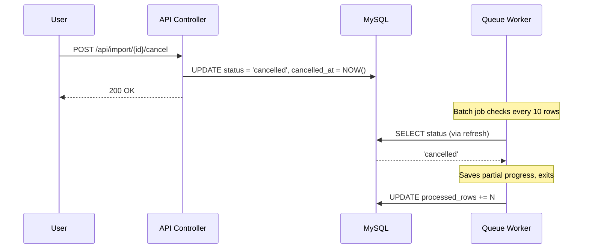

---

## 8. Redis Integration

### Purpose

| Purpose                   | Details                                                                                                               |
| ------------------------- | --------------------------------------------------------------------------------------------------------------------- |
| **Queue driver**          | Production uses `QUEUE_CONNECTION=redis`. Prevents queue polling from loading MySQL. Monitorable via Laravel Horizon. |
| **Cache for import list** | `GET /api/import` results cached for 1 minute. Version-based invalidation via `Cache::increment()`.                   |
| **Cache invalidation**    | Version counter bumps on every `POST /api/import` and `POST /api/import/{id}/cancel`.                                 |

### Cache Invalidation Flow

```
POST /api/import              POST /api/import/{id}/cancel
         │                              │
         ▼                              ▼
  Cache::increment(              Cache::increment(
    "import_list_version:          "import_list_version:
      user:{userId}")                user:{userId}")
         │                              │
         └──────────┬───────────────────┘
                    ▼
         GET /api/import next request
         sees new version → cache miss
         → fetches from DB → re-caches
```

### Why Not Cache Individual Status?

- Single-row PK lookup is <1ms in MySQL
- Progress changes every few seconds — cached data would be stale immediately
- Cache invalidation would be required after every batch job (200+ times per import)

---

## 9. Observability & Alerting

### Metrics

| Metric                | Source                                                 | Purpose                  |
| --------------------- | ------------------------------------------------------ | ------------------------ |
| `imports_started`     | `status = 'processing'`                                | Track import volume      |
| `imports_completed`   | `status = 'completed'`                                 | Track throughput         |
| `imports_failed`      | `status = 'failed'`                                    | Track failure rate       |
| `avg_processing_time` | `AVG(TIMESTAMPDIFF(SECOND, started_at, completed_at))` | Track performance trends |
| `avg_time_per_row`    | `AVG(duration / total_rows)`                           | Track per-row cost       |
| `batch_failure_rate`  | `SUM(failed_rows) / SUM(total_rows)`                   | Track data quality       |

### Stuck Import Detection

```sql
SELECT id, account_id, filename, processed_rows, total_rows,
       TIMESTAMPDIFF(MINUTE, started_at, NOW()) AS stuck_minutes
FROM import_jobs
WHERE status = 'processing'
  AND started_at < NOW() - INTERVAL 30 MINUTE;
```

### Failure Rate Alert

```sql
SELECT SUM(failed_rows) * 100.0 / NULLIF(SUM(total_rows), 0) AS failure_rate_pct
FROM import_jobs
WHERE created_at > NOW() - INTERVAL 1 HOUR
  AND status IN ('completed', 'failed')
HAVING failure_rate_pct > 20;
```

**Alert condition:** Failure rate >20% for two consecutive 5-minute checks (to avoid flapping).

---

## 10. Production Awareness

### At 10× Scale

| Concern             | Mitigation                                                   |
| ------------------- | ------------------------------------------------------------ |
| File storage        | Swap to S3 via `FILESYSTEM_DISK=s3` — zero code changes      |
| Queue throughput    | Dedicated workers via Laravel Horizon on the `imports` queue |
| Error JSON growth   | Migrate to separate `import_job_errors` table                |
| DB write contention | Reduce batch size or use Redis counters with periodic flush  |
| Concurrent imports  | Per-account concurrency limit (max 2 per account)            |

### Rollback Strategy

Everything is isolated:

- **New routes** — prefix `api/import/*`, no existing routes modified
- **New jobs** — `ProcessImportJob`, `ProcessImportBatchJob` (not used by existing code)
- **New table** — `import_jobs` (no existing tables modified)

```bash
# Rollback steps
1. Remove import routes from routes/api.php
2. php artisan queue:clear
3. php artisan migrate:rollback
4. Delete new files
```

---

## 11. Architecture Decision Records (ADR)

### ADR-1: MySQL vs Redis for Progress Tracking

**Decision:** MySQL `import_jobs` table for progress tracking.

**Rationale:** Write volume is low — one update per batch (50 rows), not per row. For a 10,000-row file, that's 200 updates. MySQL handles this trivially. ACID guarantees prevent data loss.

**Trade-off:** At extreme scale (millions of rows/hour), the `lockForUpdate()` row lock could contend. Mitigation: reduce batch size or switch to optimistic locking.

### ADR-2: Batch Size = 50

**Decision:** 50 rows per batch job.

**Rationale:** 50 rows × ~5KB = ~250KB per batch. ~1 second processing time. Leaves headroom before 30s queue timeout. The `batch_size` column makes this configurable without deployment.

### ADR-3: Single Queue vs Per-Import Queues

**Decision:** Single `imports` queue.

**Rationale:** Simpler to operate and monitor. At 10× scale, use dedicated workers. Per-import queues would require dynamic configuration and complicate debugging.

### ADR-4: Local Disk vs S3 vs Database

**Decision:** Local disk via Storage facade (swap to S3 by changing env var).

**Rationale:** Storage facade abstracts the filesystem. `FILESYSTEM_DISK=s3` is a single env var change. File must be retained for error CSV reconstruction.

### ADR-5: Batch Job Cancellation — Checkpointing Frequency

**Decision:** Check cancellation status every 10 rows.

**Rationale:** Balances responsiveness with overhead. 5 extra DB queries per batch (~25ms) is negligible. A cancelled batch stops within 10 rows (~50ms worst-case delay).

### ADR-6: Redis Caching — Version-Based vs Tagged Cache

**Decision:** Version-based cache invalidation (`Cache::increment`).

**Rationale:** Works with any cache driver (file, array, database, Redis). Incrementing a single key is O(1) and atomic. Cache tags are Redis/Memcached-only and not supported by the `array` driver used in tests.

### ADR-7: CSV Parsing — Single Parse vs Per-Batch Re-Parse

**Decision:** Parse CSV once in `ProcessImportJob`, pass pre-parsed row chunks to batches.

**Rationale:** Original design caused queue worker to crash after ~10 batches for 30,000-row files (600 full file reads). Fix reduces file reads from 600 → 1. Each batch's memory is ~250KB instead of loading the entire file.

**Trade-off:** `ProcessImportJob` holds all rows in memory temporarily (~15MB for 30k rows). For files >50MB, switch to a temp-file approach.

---

## 12. Testing

### Test Results

<p align="center">
  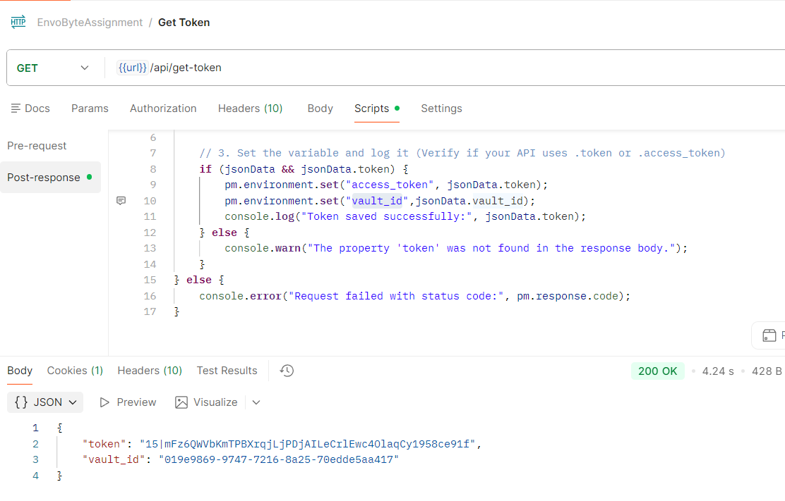
  <br/><em>1. Retrieve API token and vault ID</em>
</p>

<p align="center">
  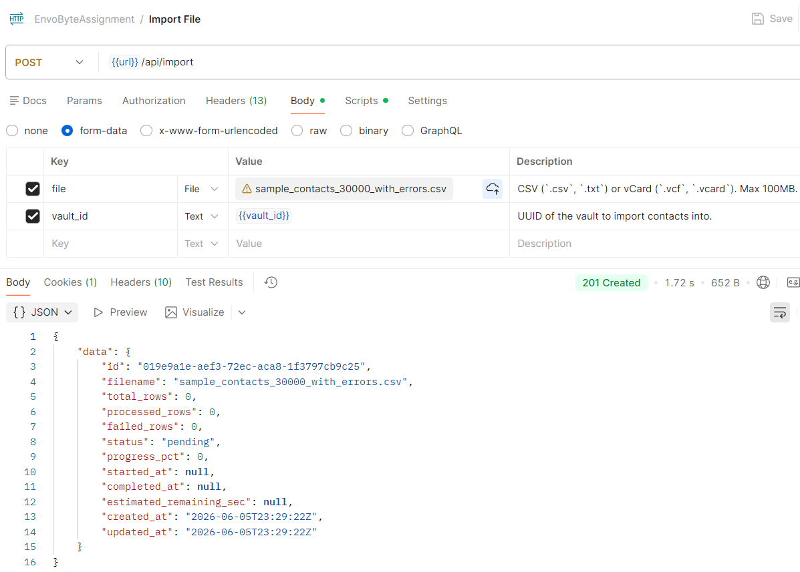
  <br/><em>2. Upload CSV file — returns 201 with pending status</em>
</p>

<p align="center">
  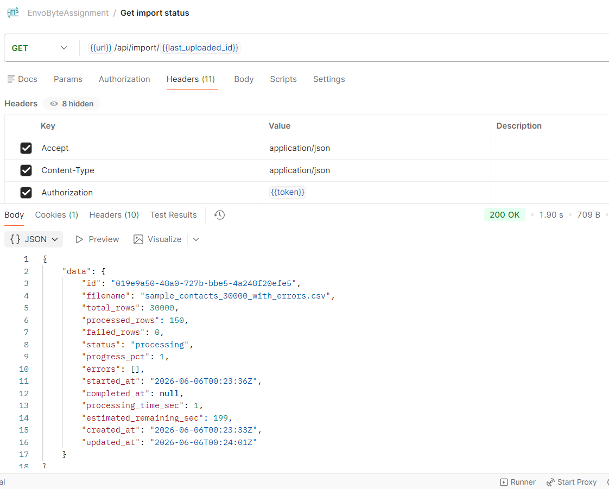
  <br/><em>3. Poll import status — shows progress percentage and processing time</em>
</p>

<p align="center">
  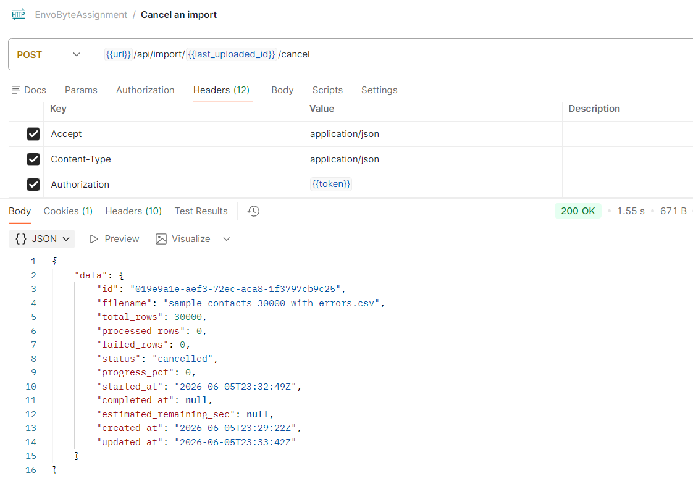
  <br/><em>4. Cancel a running import</em>
</p>

<p align="center">
  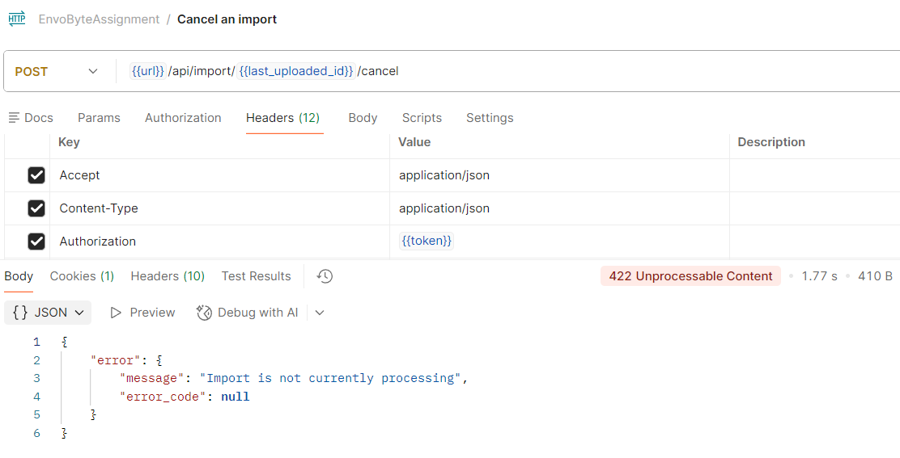
  <br/><em>5. Attempt cancel on completed import — returns 422</em>
</p>

<p align="center">
  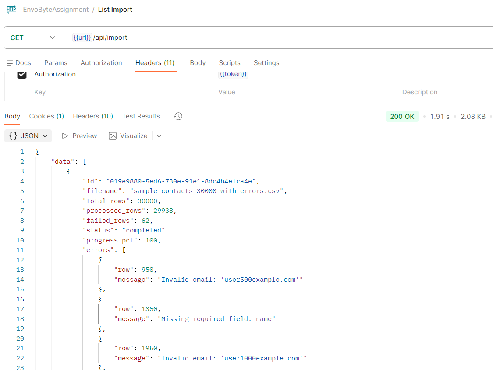
  <br/><em>6. List all imports with pagination</em>
</p>

<p align="center">
  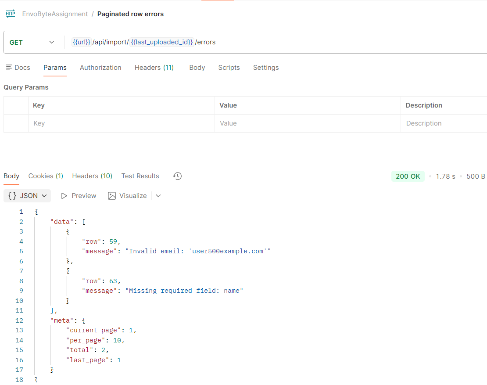
  <br/><em>7. Paginated per-row errors via API</em>
</p>

<p align="center">
  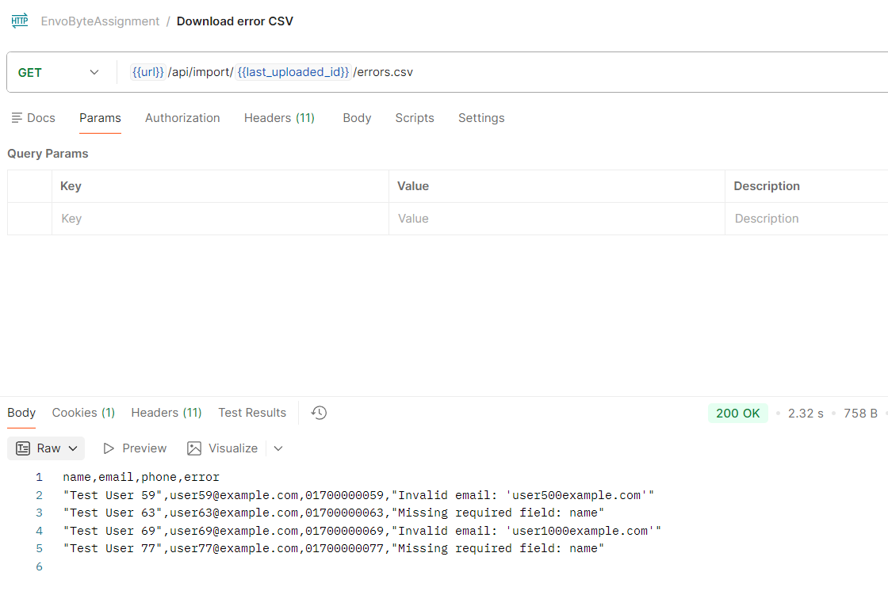
  <br/><em>8. Download error CSV — only rows with errors included</em>
</p>

<p align="center">
  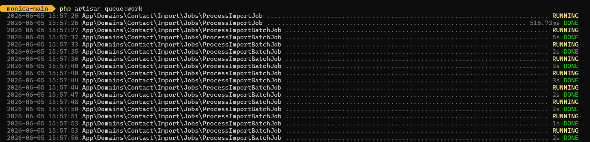
  <br/><em>9. Queue worker processing import batches asynchronously</em>
</p>

<p align="center">
  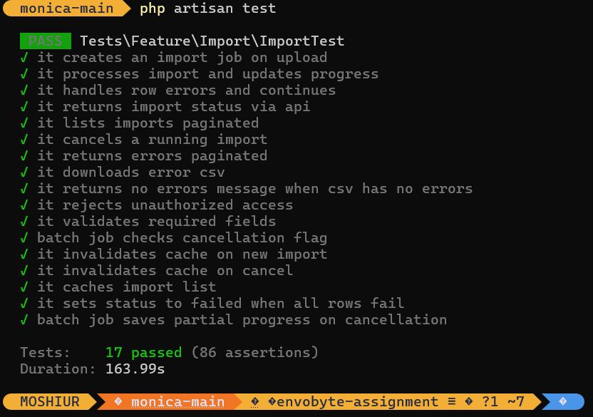
  <br/><em>10. PHPUnit test results — 17 tests, 86 assertions, all passing</em>
</p>

<p align="center">
  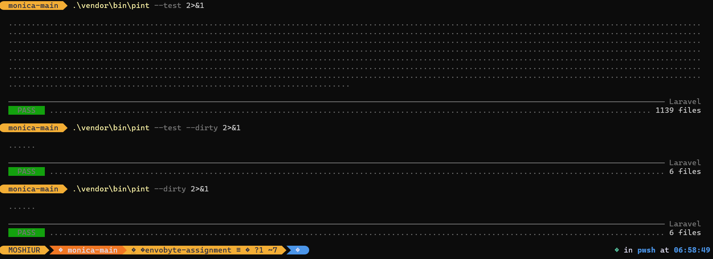
  <br/><em>11. Laravel Pint code style check — clean, no issues</em>
</p>

### Running Tests

```bash
# Run all import tests (17 tests, 86 assertions)
php artisan test --filter=Import

# Or directly via PHPUnit
vendor/bin/phpunit tests/Feature/Import/ImportTest.php
```

### Test Configuration

| Setting  | Value                         | Purpose                               |
| -------- | ----------------------------- | ------------------------------------- |
| Database | In-memory SQLite (`:memory:`) | Fast, isolated, no external DB needed |
| Queue    | Sync driver                   | Jobs execute inline — deterministic   |
| Storage  | Fake local driver             | Files kept in memory, no disk I/O     |
| Cache    | Array driver                  | In-memory, no Redis needed            |

### Test Coverage (17 tests, 86 assertions)

| Test                                                  | What It Verifies                                                           |
| ----------------------------------------------------- | -------------------------------------------------------------------------- |
| `it_creates_an_import_job_on_upload`                  | Upload → 201 → JSON structure → DB record → file stored                    |
| `it_processes_import_and_updates_progress`            | Full pipeline: pending → processing → completed, counters correct          |
| `it_handles_row_errors_and_continues`                 | Invalid rows skipped with errors, valid rows processed, status = completed |
| `it_returns_import_status_via_api`                    | `GET /api/import/:id` returns progress_pct, processed_rows, timestamps     |
| `it_lists_imports_paginated`                          | `GET /api/import` returns paginated results with meta                      |
| `it_cancels_a_running_import`                         | Cancel → status = cancelled, cancelled_at set, rejects non-processing      |
| `it_returns_errors_paginated`                         | Errors endpoint returns correct pagination (per_page, last_page)           |
| `it_downloads_error_csv`                              | Error CSV contains only error rows, correct headers and disposition        |
| `it_returns_no_errors_message_when_csv_has_no_errors` | Empty errors → `No errors found.` message                                  |
| `it_rejects_unauthorized_access`                      | Other users' imports return 404                                            |
| `it_validates_required_fields`                        | Missing file or vault_id returns 422                                       |
| `batch_job_checks_cancellation_flag`                  | Cancelled import → batch exits early, no contacts created                  |
| `it_invalidates_cache_on_new_import`                  | `Cache::increment` called on POST /api/import                              |
| `it_invalidates_cache_on_cancel`                      | `Cache::increment` called on POST /api/import/{id}/cancel                  |
| `it_caches_import_list`                               | List endpoint works with populated cache                                   |
| `it_sets_status_to_failed_when_all_rows_fail`         | All rows invalid → status = failed, not completed                          |
| `batch_job_saves_partial_progress_on_cancellation`    | Partial progress saved when cancellation detected                          |

---

## 13. Development Setup

### Prerequisites

- PHP 8.3+
- MySQL 8.0+ (or SQLite for testing)
- Composer dependencies installed
- Laravel queue tables migrated

### Environment

```ini
# .env — Development
QUEUE_CONNECTION=database
DB_CONNECTION=mysql
```

> **Critical:** `QUEUE_CONNECTION` must NOT be `sync` in development — with `sync`, jobs execute during the HTTP request, violating the <500ms upload target.

### Quick Start

```bash
# Terminal 1: Start queue worker
php artisan queue:work

# Terminal 2: Get a test token
curl http://localhost/get-token
# → {"token":"1|abc123...","vault_id":"01J0X1Y2Z3..."}

# Upload a CSV
curl -X POST http://localhost/api/import \
  -H "Authorization: Bearer <token>" \
  -F "file=@contacts.csv" \
  -F "vault_id=<uuid>"
# → 201 Created, status "pending"

# Poll status
curl http://localhost/api/import/<id> \
  -H "Authorization: Bearer <token>"
```

---

## 14. Files Changed / Added

### New Files

| File                                                                 | Purpose                                                                            |
| -------------------------------------------------------------------- | ---------------------------------------------------------------------------------- |
| `database/migrations/2026_06_05_000001_create_import_jobs_table.php` | Import jobs schema                                                                 |
| `app/Models/ImportJob.php`                                           | Model with scopes, status helpers, progress calculation                            |
| `database/factories/ImportJobFactory.php`                            | Test data factory                                                                  |
| `app/Http/Resources/ImportJobResource.php`                           | API resource with `progress_pct`, `estimated_remaining_sec`, `processing_time_sec` |
| `app/Domains/Contact/Import/Services/CsvParser.php`                  | CSV parsing, normalization, validation                                             |
| `app/Domains/Contact/Import/Services/ImportContactFromRow.php`       | Single-row import using existing Monica services                                   |
| `app/Domains/Contact/Import/Jobs/ProcessImportJob.php`               | Orchestrator — parse CSV, count rows, dispatch batches                             |
| `app/Domains/Contact/Import/Jobs/ProcessImportBatchJob.php`          | Batch processor — 50 rows, error isolation, atomic progress                        |
| `app/Domains/Contact/Import/Api/Controllers/ImportController.php`    | 6 API endpoints                                                                    |
| `tests/TestCase.php`                                                 | Test base class                                                                    |
| `tests/Feature/Import/ImportTest.php`                                | 17 feature tests                                                                   |
| `screenshots/`                                                       | API testing screenshots                                                            |

### Modified Files

| File             | Change                                                                      |
| ---------------- | --------------------------------------------------------------------------- |
| `routes/api.php` | Added import resource routes + cancel/errors/errors.csv + `get-token` route |
| `.gitignore`     | Ignore uploaded files                                                       |
